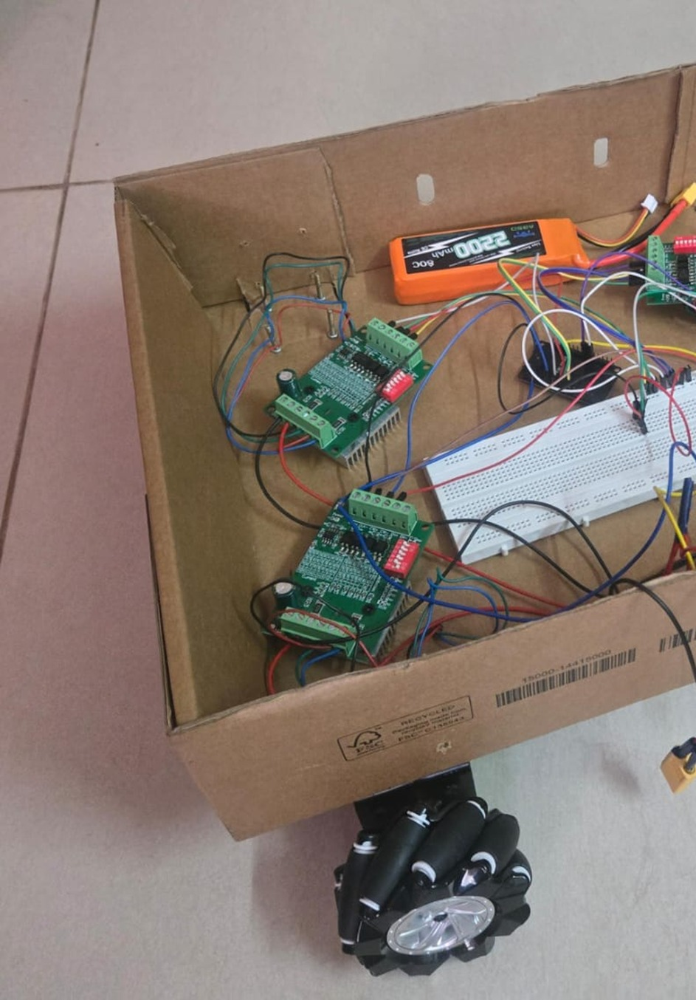

# Trash

## **The Motivation: The Interception Problem**
Most mobile robots are built for predictable tasks—like following lines or avoiding static walls. But intercepting a fast-moving, flying object in mid-air is a completely different challenge. 

A standard steered vehicle (like an RC car) takes too long to maneuver because it has to stop, turn its wheels, and then drive forward. When an object is falling, you don't have time for a turning radius. 

We built **Auto-Trash** to solve this. Instead of turning, it uses an omnidirectional (Mecanum) drivetrain to instantly "strafe" sideways or diagonally to catch the target exactly where it lands.

## **A Multidisciplinary Engineering Project**
Catching a projectile isn't just a software problem; it requires hardware and physical structure to react in milliseconds. This project integrates three core engineering disciplines:

* **Software & AI (The Brain):** Using YOLOv8 and stereo cameras to track the flying object, and applying real-time physics to predict its exact 3D landing coordinates.
* **Electrical & Power (The Nervous System):** Designing a dual-voltage power system that safely drives high-torque industrial stepper motors (12V) alongside a low-voltage logic controller (5V) without causing electrical failure.
* **Mechanical & Structural (The Muscle):** Engineering a custom, low-center-of-gravity chassis and reinforcing the mechanical wheel couplings so the robot can handle sudden, jerky accelerations without vibrating apart or tipping over.

The result is a fully autonomous vehicle that bridges the gap between computer vision and physical, high-speed hardware actuation.

***

It consists of a setup of two cameras positioned towards the center of your room, where your trash can is. These cameras send the data stream over to the garbage tracking algorithm, which detects the garbage in each camera using a custom trained YOLOV8 model with over 14,000 hand-labeled images. 

Our algorithm then takes the combined positions of the trash in both camera streams, performs 3D triangulation (Sine Law), and calculates the expected landing position using SVD-based trajectory fitting and kinematics (gravity constants). The target coordinates are then sent to our Trash robot wirelessly via **TCP/IP Sockets** to an **ESP32** microcontroller. We also have a real-time plotting script to visualize the flight path in 3D.

## The Robot
Our trash robot consists of a **reinforced cardboard chassis** and four mecanum wheels powered by Nema 17 stepper motors. Mecanum wheels allow for omnidirectional movement, enabling the most efficient path to the catch point. The steppers are driven by TB6560 drivers (3A at 35V), powered by a 3S, 2200mAh LiPo battery.

While the original prototype used a Teensy 4.0, the latest revision uses an **ESP32** to handle wireless target reception via WiFi. We use the AccelStepper library to manage vector-based movement, continuously updating the robot's destination as the tracking system sends more accurate data during the trash's flight.

## Hardware Setup (BOM)

### **Electronics & Control**
*   **1x ESP32-WROOM-32**: The main microcontroller managing Wi-Fi and motor pulse generation.
*   **4x TB6560 Stepper Motor Drivers**: Industrial amplifiers pushing 12V power to the motors.
*   **1x LM2596 Buck Converter**: Stepping down the battery voltage to a safe 5.0V for the ESP32.

### **Power System**
*   **1x 12.4V (3S) LiPo Battery**: High-discharge main power source.
*   **1x USB Power Bank** *(Optional)*: Secondary clean power via micro-USB/USB-C for testing the ESP32.

### **Drivetrain**
*   **4x NEMA 17 Stepper Motors**: High-torque actuators (5mm shafts).
*   **4x 80mm Mecanum Wheels**: Providing omnidirectional mobility.

### **Chassis & "Hacks"**
*   **Cardboard Base**: Lightweight main frame.
*   **4x Vertical Sticks/Dowels**: Corner posts for the basket.
*   **1x Trash Bag**: Stretched across posts to create the catching surface.
*   **Aluminum Soda Can Strips**: Custom-cut shims to tighten loose wheel hubs.
*   **Teflon Tape (PTFE)**: Wrapped on motor shafts for a friction-fit with wheels.
*   **Hot Glue & Electrical Tape**: Securing posts, isolating wire hubs, and bonding shims.

### **Wiring & Connections**
*   **Jumper Wires**: Logic signals (ESP32 to `PUL+` / `DIR+`).
*   **Wire Splice Hub**: Central bridge linking all `CLK-` and `CW-` wires to common ground.
*   **Power Junction**: Solder-terminated 4-way split from battery to drivers.

### **Off-Board Hardware**
*   **1x Laptop**: Running Python, YOLOv8, and the Wi-Fi socket server.
*   **1x External Camera (or Smartphone)**: Used for the second perspective on the stereo 3D vision.
*   **Camera Mount/Tripod**: Maintaining the known distance between cameras for accurate triangulation.

## Project Structure & Features
 - **Coordinate Smoothing**: `track_ball.py` now uses a 4-frame moving average (via `deque`) to filter out sensor jitter and clean up the 3D trajectory.
 - **Socket Communication**: `sending_data.py` manages the wireless link. It watches the `prediction` file and pushes coordinates to the ESP32 IP over port 80.
 - **`target_0` and `target_1`**: Files containing real-time XY coordinates from both cameras.
 - **`continue_plot.py`**: The "brain" that reads targets, triangulates 3D space, and predicts the landing spot. Note: `D_CAM` (camera spacing) is currently set to **120cm**.
 - **`yolov8_model`**: The core detection model trained for 47 epochs.

# Running the Code
1. **Initial Setup**:
   - Install Python dependencies: `pip install -r requirements.txt` (or `requirements-windows.txt`).
   - Install Node dependencies: `pnpm install` (Required for the `dev` command).
   - Install `nodemon` globally: `npm i -g nodemon`.

2. **Starting the System**:
   - Connect two cameras (one laptop webcam + one USB webcam).
   - Run `pnpm dev` to start both camera trackers and the 3D plotter simultaneously with hot-reloading.
   - Run `python sending_data.py` in a separate terminal to begin wireless transmission to the robot.

*Note: Ensure your ESP32 IP is correctly set in `sending_data.py`.*

